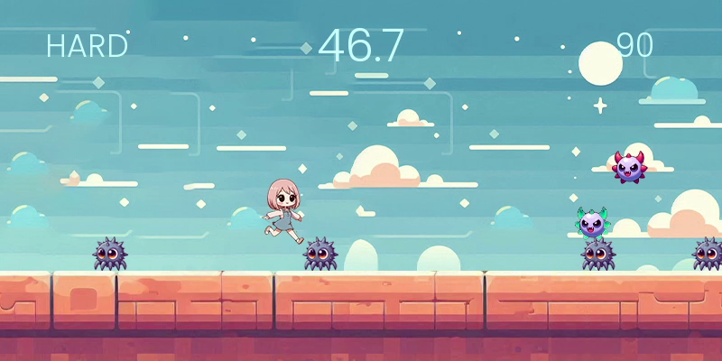

# Nami Runner

Nami Runner é um jogo estilo running game desenvolvido com Pygame e Tkinter com base no tutorial [The ultimate introduction to Pygame](https://www.youtube.com/watch?v=AY9MnQ4x3zk) do canal Clear Code. O objetivo do jogo é correr pelo máximo de tempo possível, desviando dos inimigos e tentando alcançar a maior pontuação.

## Características

- **Suporte para Gamepad**: Jogue com conforto usando seu gamepad preferido.
- **Nível de Dificuldade**: 3 níveis de dificuldade selecionáveis: Easy, Normal, Hard.
- **Registro de Highscores**: Registre suas melhores pontuações por nível de dificuldade.
- **Trilha Sonora**: Escolha entre três músicas autorais para ouvir enquanto joga.

## Gameplay

## Screenshots

*Exemplo de gameplay do Nami Runner*

*Tela de highscore do Nami Runner*

## Controles

- **Teclado**:
    - **Espaço**: Pular
    - **WASD/Teclas Direcionais**: Movimentação

- **Gamepad**:
    - **Botão A**: Pular
    - **D-Pad/Left Stick**: Movimentação

## Configurações

Na tela de configurações, você pode ajustar várias opções do jogo:

- **Velocidade dos Obstáculos**:
  - **Velocidade Inicial**: Define a velocidade inicial dos obstáculos.
  - **Aceleração**: Define a taxa de aceleração dos obstáculos.
  - **Velocidade Máxima**: Define a velocidade máxima que os obstáculos podem alcançar.
  - Clique em "Inserir valores" para aplicar as alterações.

- **Nível de Dificuldade**:
  - Selecione o nível de dificuldade mais adequado, entre Easy, Normal e Hard.

- **Opções Padrão**:
  - Clique em "Resetar opções aos padrões" para restaurar as configurações padrão do jogo.
  - Clique em "Resetar Highscore" para zerar a pontuação mais alta registrada.

- **Seleção de Música**: Escolha entre três músicas autorais para ouvir durante o jogo:
  - **Street Race at Dawn**
  - **Dew Gathering**
  - **Cryptic Puzzle**
  - **None**: Jogue sem música.

- **Volume**: Ajuste o volume da música de fundo usando a barra de volume.
